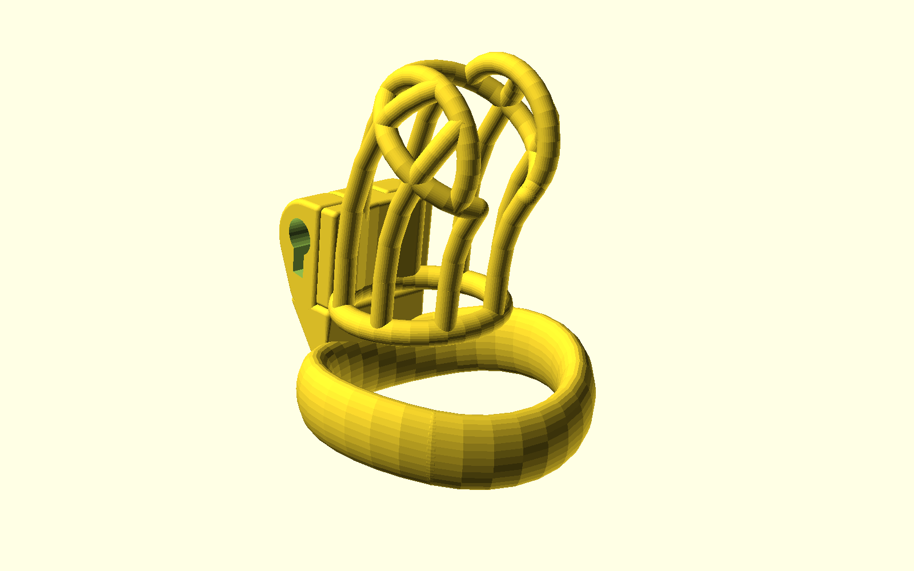

# (18+ NSFW) Parametric 3D-printable chastity cage in OpenSCAD

 This work is licensed under a <a rel="license" href="http://creativecommons.org/licenses/by-sa/3.0/">Creative Commons Attribution-ShareAlike 3.0 Unported License</a>.

This is a fork of [heyspacebucks parametric chastity cage](https://github.com/heyspacebuck/parametric-chastity-cage) which is a major overhaul of [Dani119's parametric chastity cage](https://www.thingiverse.com/thing:2764421).

This fork aims to improve further development and better printability.
